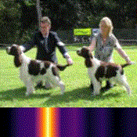
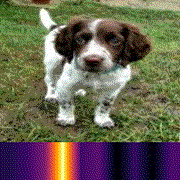
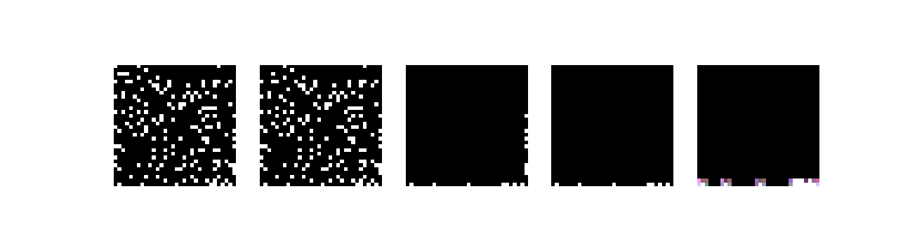

# Data Augmentation Impact

## Quickstart:
Clone project and run:
```
conda env create -f environment.yml -n augmentation-impact
conda activate augmentation-impact
```
Then analyse your image in the notebook `notebooks/augmentation_control.ipynb` 
or inside a Voilá app by running:
```
voila notebooks/augmentation_control.ipynb
```
Note that inside the voila app it doesn't work yet to open the resulting gif. You can find it at `imgs/results.gif`.

### Idea
The goal of this project was to provide a tool to analyze the impact of data augmentation on the network activation of a CNN. The input data are images and the output a categorical classification. Later modifications of the code made it possible to also have a regression target. 

The outcome of the project is a GUI with some widgets to continually control different augmentation methods. For every step in the augmentation a localization map is computed which highlights the important regions in the picture which led to the actual prediction. The pictures can then be concatenated to a gif to quickly express the change of activation during the data augmentation. 

The final tool can be used to understand the impact of an augmentation method on your model. This has several benefits: Firstly a user can better understand to which degree an augmentation method is valid to still stay in the original input domain. This information can be used before starting the model training to have variable and valid data. 

Furthermore, the tool can be used to analyze a pre-trained model for possible blackspots. By augmenting a single image and visualizing the model attention in parallel it's very easy to quickly detect edge cases. For example, a simple continuous brightness change can show the user at which point your model breaks. The user can then decide if the image is too dark/bright or if the model needs retraining with better brightness augmentation. Additionally, a pre-trained model can be analyzed by occluding specific objects in the input image via an erase box. This can be very helpful when investing wrong model predictions or regression models. 

In the examples section, several examples for these usecases are shown.


#### Key Points:

- The dataset for testing the application was [Imagenette](https://github.com/fastai/imagenette) [4]
- The model for testing the application was a pre-trained Resnet50 [8] on Imagenet [5]
- The used augmentation transformations are: center crop, brightness adjustment, rotation, perspective distortion, erasing box
- The used deep learning libraries are [pytorch](https://github.com/pytorch/pytorch) [6] and [fastai](https://github.com/fastai/fastai) [7]
- The modes Gradcam, guided gradient, and Guided-Gradcam are available for activation localization visualization. 
  The original Guided-Gradcam implementation was taken from [3] but almost entirely rewritten.
- Additionally, the last layer activation is visualized and the model class prediction is displayed
- The GUI was developed via jupyter widgets
- Voilá was used for app generation

## Guided-GradCam in a Nutshell


Guided-GradCam consists of 2 parts: GradCam and Guided Backpropagation. In the above figure, an example for each concept is shown. 

#### GradCam
GradCam provides a way to highlight the areas in the image which triggered the model features to be active (CAM - Class Activation Mapping) and important for the output (Gradient). The importance (mean gradient for each feature) is then multiplied with the feature activation, and the resulting activation map is resized to match the original input. 

#### Guided Backpropagation
Guided Backpropagation is a method to find the concepts of the image that have the highest positive contribution to the output. Only the positive part of the gradient is multiplied with the positive part of the activation. Therefore, only features that positively contribute to the chosen class remain.

#### Guided-GradCam
The combination of both: The resulting maps are simply multiplied element-wise with each other. 


## Augmentation Impact Analyzer App

This app can be used to understand the impact of an augmentation method on your CNN via the control of a GUI. 

The available augmentation methods are:
- Brightness Modification
- Center Crop
- Rotation Angle 
- Perspective Distortion
- Erase Box

Many more augmentation methods are described in [1] and can be easily integrated to adapt the application to the users' needs.

To understand the impact of the augmentation on the model, the methods GradCam, Guided Backpropagation and Guided-GradCam are available. The pictures can be concatenated to a gif to quickly express the change of activation during the data augmentation.

### Preset App Settings
This example run of the app runs a pre-trained Resnet50 on [Imagenet](http://www.image-net.org/). The output classes are restricted to the 10 classes from [Imagenette](https://github.com/fastai/imagenette). 

The uploaded images will automatically be cropped to a size of (160x160). The app runs via [Voilá](https://github.com/voila-dashboards/voila) [9].

### App Output
The resulting image shows the augmented image or (if an analysis method is chosen) the important regions/concepts for the model. 
The highest predicted class is automatically chosen to perform the model analysis. On top of the image, the prediction score for this class is displayed. 
At the bottom of the image, the last layer activation for the 10 classes is shown.

### App Deployment
The app is deployed on [Heroku](https://augmentation-impact.herokuapp.com/) [10] and can be tested there.

## Examples
#### Rotation Example


Below we show a rotation sequence of an image where a person holds a tench. The respective Guided-GradCam output is displayed in the second row. As one can see, the prediction stays coherent during the rotation, which indicates that the model successfully learned rotation invariant representations for the tench class. But by analyzing the Guided-GradCam output we see that the model focus is more on the hands than on the fish. There are probably a lot of tench images with hands holding the fish, so it might be that the model didn't learn to predict a "tench" but to predict "A person holds a tench in his hands".


Indeed if we take a tench image without hands and rotate it, it fails at some point and confuses the tench with a french horn.


#### Erase Box Model Analysis


Below an example is shown how to analyze the model prediction via an erase box. Again the respective Guided-GradCam output is displayed in the second row. As one can see, the model uses both dogs for its prediction if available. When we erase one dog, it focuses on the other. When we occlude both dogs, the prediction fails.


#### Sharp Edges Example


Another important insight is that the model is very sensitive to sharp edges. Below one can see the transformation from a dog image to a church. To decide if this is a possible input for the final model is up to the user, but it is important to know the limits of the model.


#### Regression Example
For this example, a small CNN was trained on black images containing white points. The target was to count the number of points in the image. After some initial training, the model already performs very well with a mean average error of nearly zero. 

To analyze how well it really works we can use the AugmentationImpactAnalyzer. In the following figure, an image sequence of possible input images is shown. The first image is the original input image. In the second we erased a few points at the top. The score (not shown here) was adapted correctly. In the third image, we erased almost the entire image but the score was still correct. In the fourth image, only the last row remains. Now the model counts one point less. So we see it's not perfect yet. The last image shows the respective Guided-GradCam output. We can see that the model is not able to focus on single pixels only. Therefore it has to do some complex calculations to avoid double counting. That's probably the reason why it still can fail. 



### Outlook
The AugmentationImpactAnalyzer also works with time-series data if the sequences are handled as if they were grayscale images. The next step would be to adapt the implemented augmentation methods for time series. Also, the output display should be enhanced to switch between image and graph representation. 
