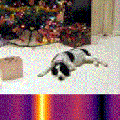

# Data Augmentation Impact

## Quickstart:
Clone project and run:
```
conda env create -f environment.yml -n augmentation-impact
conda activate augmentation-impact
```
Then analyse your image in the notebook `notebooks/augmentation_control.ipynb` 
or inside a Voilá app by running:
```
voila notebooks/augmentation_control.ipynb
```
Note that inside the voila app it doesn't work yet to open the resulting gif. You can find it at `imgs/results.gif`.

### Project Idea:
The goal of this project is to provide a tool to analyze the impact of data augmentation on network activation. The input data type will be images and the output a categorical classification. The outcome of the project should be a GUI with some widgets to continually control different augmentation methods. For every step in the augmentation a localization map is computed which highlights the important regions in the picture which led to the actual prediction. The pictures will then be concatenated to a gif to quickly express the change of activation during the data augmentation. 

The final tool can be used to understand the impact of an augmentation method on your model. 

### Key Points:

- The dataset will be [Imagenette](https://github.com/fastai/imagenette])
- The model will be a pre-trained Resnet on Imagenet 
- The augmentation methods will be a subset from the methods listed in [1] (e.g. brightness, warping...)
- The model activation focus will be calculated via gradient-based localization [2]
- The used deep learning libraries will be [pytorch](https://github.com/pytorch/pytorch) and [fastai](https://github.com/fastai/fastai)
- The GUI will be made via Jupyter Widgets and [Voilá](https://github.com/voila-dashboards/voila) or [Streamlit](https://github.com/streamlit/streamlit). I will try out both at the beginning to see what works better. 

### Project Plan:
- Project setup: Get the dataset and the pre-trained model. Test the model on the data. Estimated time: 1 day (used: 1 day)
- Try and choose some augmentation methods and generate gif from the continuously augmented input. Estimated time: 1 day (used: 1 day)
- Read the Grad-Cam[2] paper and implement it (or integrate existing implementation). Estimated time: 3-6 days (used: 2 days)
- Add GUI to control data augmentation, calculate localization map per image, and save in gif. 3-5 days (used: 3 days)
- Final report and presentation preparation: 3-5 days

Sum of days: 11-18


### Current State:
- Basic GUI with jupyter widgets
- Augmentation transformations: Center crop, brightness adjustment, rotation, perspective distortion, erasing box
- last layer activation visualization
- cam, gradient and gradcam for activation localization visualization. The original gradcam implementation was taken from [3]
- Voilá for app generation


### Examples
#### Rotation Example:


#### Erase Box Example


#### Model failure with a combination of rotation and erase box


#### Model failure because of sharp edges
In the following example you can see that with the addition of some sharp black regions we can transform a dog into a church


### Next Steps:
- Add more documentation
- Modify code to pass grad-cam models via argument. Then put notebook code into src.
- Modify grad-cam to work with regression
- Modify AugmentationImpactAnalyzer to work with Timeseries

### References:
- [1] [Shorten, Connor, and Taghi M. Khoshgoftaar. "A survey on image data augmentation for deep learning." Journal of Big Data 6.1 (2019): 60.](https://link.springer.com/article/10.1186/s40537-019-0197-0)
- [2] [Selvaraju, R. R., et al. "Grad-CAM: visual explanations from deep networks via gradient-based localization. arXiv website. arxiv. org/abs/1610.02391." Revised March 21 (2016).](https://arxiv.org/pdf/1610.02391.pdf)
- [3] Grad-cam implementation https://github.com/jacobgil/pytorch-grad-cam
```python

```
